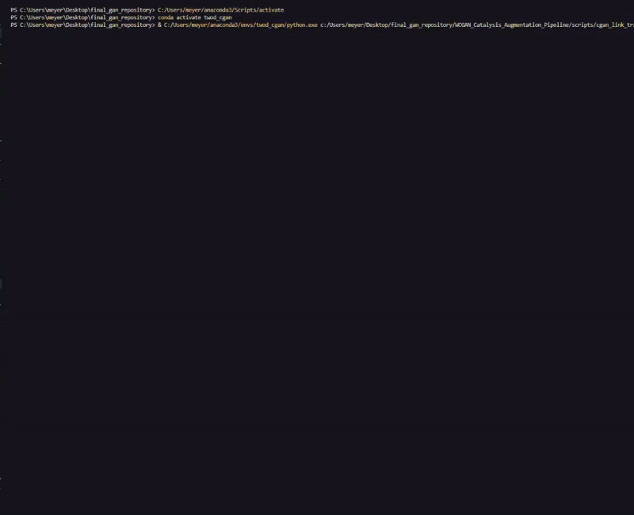

Repository for Neuroimaging Data Catalysis Augmentation Pipeline Described in Paper: https://papers.ssrn.com/sol3/papers.cfm?abstract_id=5240695

Creating the pipeline is split into two parts:
  Part 1: Training of the WCGAN on SUVR data

          1: Use scripts/wgan-suvr.py or scripts/wgan-suvr-longform.py to train the WCGAN (either on given SUVR data or data of your own) - 
             use wgan-suvr.py for shorter training protocols and wgan-suvr-longform.py for longer training protocols that you would like to checkpoint
          2: You can alter the architecture of the WCGAN inside scripts/lib/gan_architecture.py

  Part 2: Linking trained WCGAN to Machine Learning Classifiers

          1: Run scripts/cgan_link_training_stat_sig.py 
          2: Select which machine learning classifier you want to optimize parameters for/use for classification (XGBoost, SVM, RandomForest, DecisionTree, LogReg)
          3: Synthetic data generation and filtration process will augment and test synthetic data points for model classification performance enhancement
          4: You can change the amount of synthetic data points tested by changing the "training_iterations" conditional of the while loop for model training.
             WCGAN is set to produce synthetic samples in batches of 100 (100 training iterations means 100*100 total synthetic data points tested.
          5: Successful synthetic candidates that passed the filtration process will be saved inside the scripts folder, along with stats about 
             the training process

Plotting Scripts

    To plot the KDE distributions of synthetic data versus real data, use scripts/kde_plotting.py. In our paper, we generate and average synthetic data of both classes and plot the average distributions against the distributions of the original data.
    We generate these averages and construct their dataframes using scripts/generate_data.py. Within the sb.kdeplot() of kde_plotting.py, point the script to the dataframes you would like to plot the distributions of. 
  
    For violin plotting, in our paper we used scripts/violin_data.py to generate 11000 synthetic AUD samples and 16000 synthetic control samples. These sets of synthetic samples are processed in batches of 11 AUD samples and 16 control samples at a time. 
    For each batch, 4 KL divergence values are calculated for all 8 regions of the Cingulate (synth AUD to real AUD, synth control to real control, synth AUD to real control, synth control to real AUD). 
    scripts/divergence_plot_violin.py is then used to construct the violin plots for these calculated KL divergence values. 
  
    To plot the model metric performance increases caused by your successful synthetic catalysts, use scripts/metrics_plt.py and point the script towards your pickled metrics files for each model. 
  
